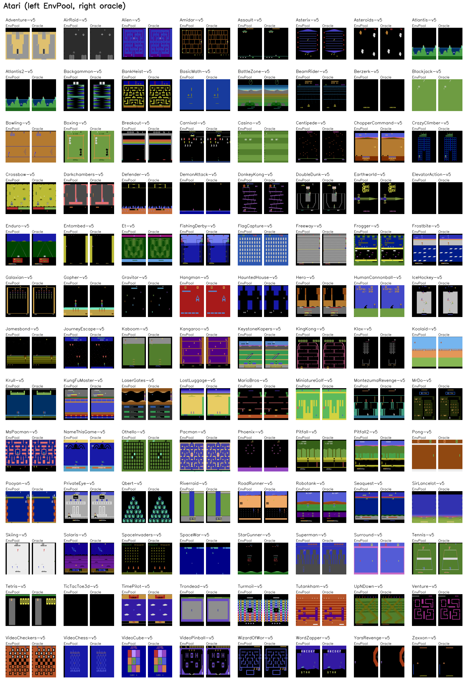
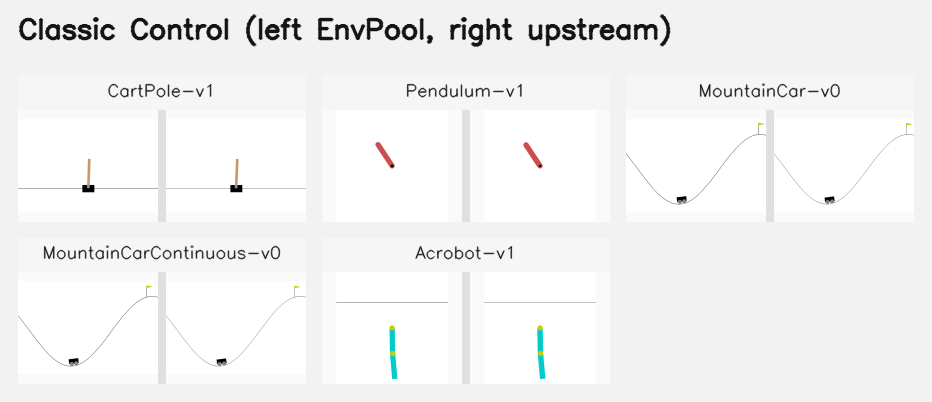
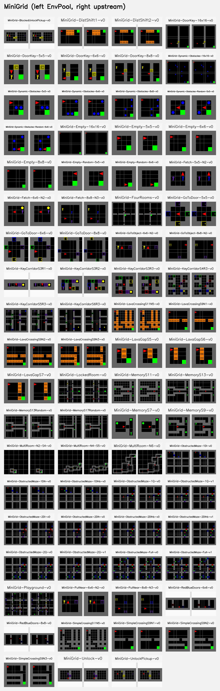
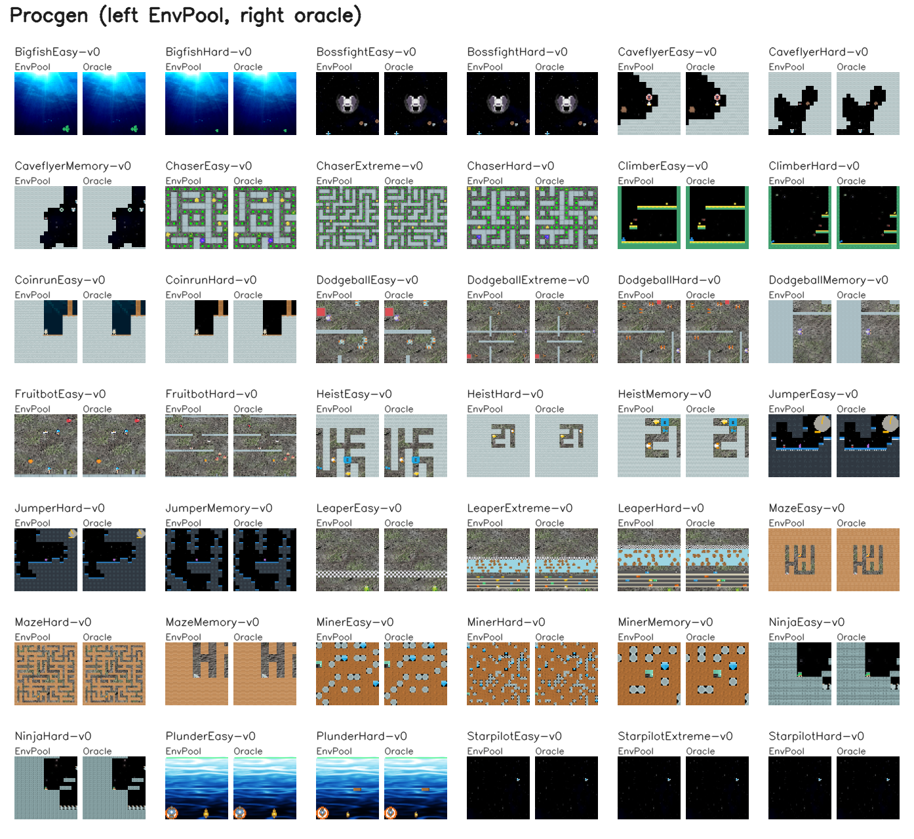
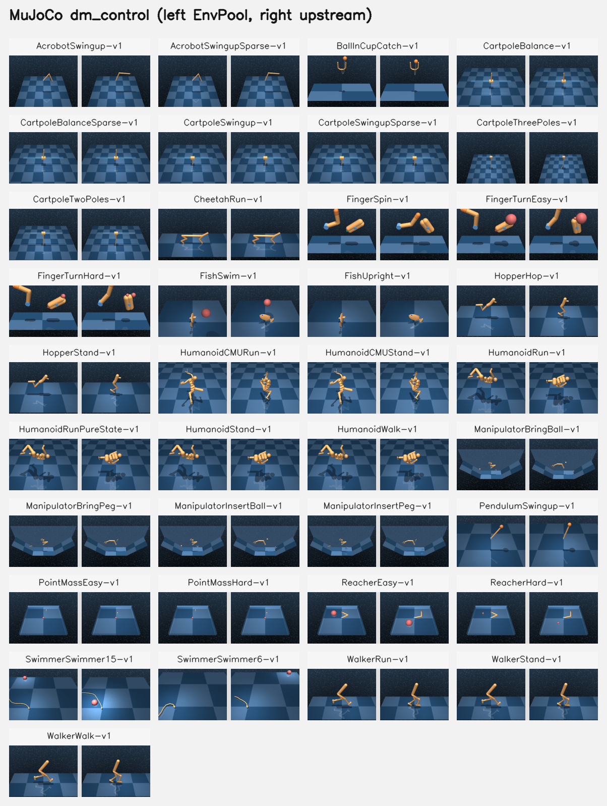
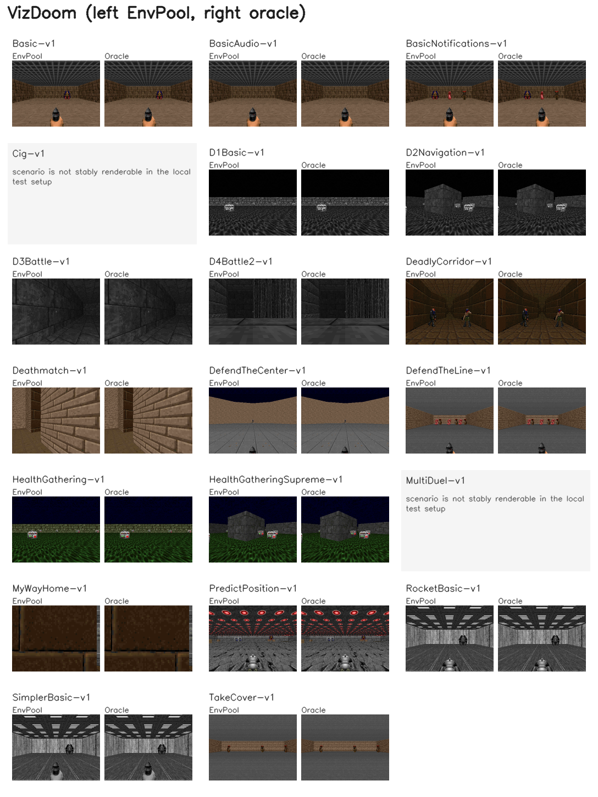
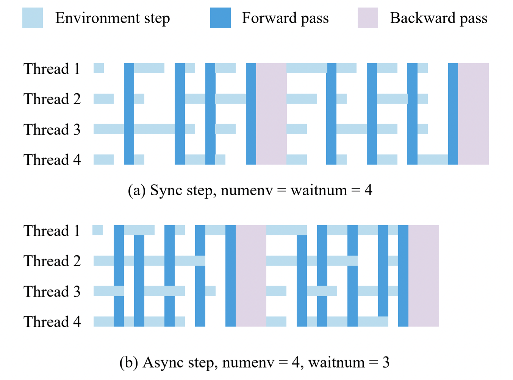

Python Interface
================

envpool.make
------------

The main interface is ``envpool.make`` where we can provide a task id and some
other arguments (as specified below) to generate different configuration of
batched environments:

* ``task_id (str)``: task id, use ``envpool.list_all_envs()`` to see all
  support tasks;
* ``env_type (str)``: generate with the Gymnasium-compatible wrapper or
  ``dm_env.Environment`` interface, available options are ``dm``, ``gym``, and
  ``gymnasium``;
* ``num_envs (int)``: how many envs are in the envpool, default to ``1``;
* ``batch_size (int)``: async configuration, see the last section, default
  to ``num_envs``;
* ``num_threads (int)``: the maximum thread number for executing the actual
  ``env.step``, default to ``batch_size``;
* ``seed (int | Sequence[int])``: set seed over all environments. If an int is
  provided, the i-th environment seed will be set with i+seed. If a sequence
  is provided, it must contain exactly one seed per environment. The default is
  ``42``;
* ``max_episode_steps (int)``: set the max steps in one episode. This value is
  env-specific (27000 steps or 27000 * 4 = 108000 frames in Atari for
  example);
* ``max_num_players (int)``: the maximum number of player in one env, useful
  in multi-agent env. In single agent environment, it is always ``1``;
* ``thread_affinity_offset (int)``: the start id of binding thread. ``-1``
  means not to use thread affinity in thread pool, and this is the default
  behavior;
* ``reward_threshold (float)``: the reward threshold for solving this
  environment; this option comes from ``env.spec.reward_threshold`` in the
  Gymnasium API, while some environments may not have such an option;
* ``gym_reset_return_info (bool)``: a deprecated compatibility flag kept in the
  config schema. EnvPool's ``gym`` wrapper follows Gymnasium reset semantics and
  always returns ``(obs, info)``; passing ``False`` raises ``ValueError``;
* ``render_mode (str | None)``: render behavior exposed by the Python wrapper.
  Available options are ``None`` (default), ``"rgb_array"``, and ``"human"``;
* ``render_env_id (int)``: default env id used by ``env.render()`` when
  ``env_ids`` is omitted, default to ``0``;
* ``render_width`` / ``render_height``: fixed output size for ``render()``.
  If omitted, the environment-specific default render size is used;
* ``render_camera_id (int)``: default camera id used by ``render()``, default
  to ``-1``;
* other configurations such as ``img_height`` / ``img_width`` / ``stack_num``
  / ``frame_skip`` / ``noop_max`` in Atari env, ``reward_metric`` /
  ``lmp_save_dir`` in ViZDoom env, please refer to the corresponding pages.

The observation space and action space of resulted environment are
**channel-first** single environment's space, but each time the
observation/action's first dimension is always equal to ``num_envs``
(sync mode) or equal to ``batch_size`` (async mode).

``envpool.make_gym``, ``envpool.make_dm``, and ``envpool.make_gymnasium`` are
shortcuts for ``envpool.make(..., env_type="gym" | "dm" | "gymnasium")``,
respectively.

envpool.make_spec
-----------------

If you don't want to create a fake environment, meanwhile want to get the
observation / action space, ``envpool.make_spec`` would help. The argument is
the same as ``envpool.make``, and you can use

- ``spec.observation_space`` gym's observation space;
- ``spec.action_space`` gym's action space;
- ``spec.observation_spec()`` dm_env's observation spec;
- ``spec.action_spec()`` dm_env's action spec;

to get the desired spec.

Extended API
------------

We mainly change two functions' semantic: ``reset`` and ``step``, meanwhile
add another two primitives ``send`` and ``recv``:

* ``reset(id: Union[np.ndarray, None]) -> TimeStep``: reset the given ``id``
  envs and return the corresponding observation;
* ``async_reset() -> None``: it only sends the reset command to the executor
  and return nothing;
* ``send(action: Any, env_id: Optional[np.ndarray] = None) -> None``: send the
  action with corresponding env ids to executor (thread pool). ``action`` can
  be numpy array (single observation) or a dict (multiple observations);
* ``recv() -> Union[TimeStep, Tuple[Any, np.ndarray, np.ndarray, np.ndarray]]``
  : receive the finished env ids (in ``timestep.observation.obs.env_id`` (dm)
  or ``info["env_id"]`` (gym / gymnasium)) and corresponding result from
  executor;
* ``step(action: Any, env_id: Optional[np.ndarray] = None) -> Union[TimeStep,
  Tuple[Any, np.ndarray, np.ndarray, Any]]``: given an action, an env (maybe
  with player) id list where ``len(action) == len(env_id)``, the envpool will
  put these requests into a thread pool; then, if it reaches certain
  conditions (explain later), it will return the env id list ``env_id`` and
  result that finished stepping.

In short, ``step(action, env_id)`` == ``send(action, env_id); return recv()``

Rendering
---------

EnvPool exposes rendering through the Python wrapper. When creating an env with
``render_mode="rgb_array"``, calling ``render()`` returns a batch of RGB frames
with shape ``(B, H, W, 3)`` and data type ``uint8``. Even a single env render keeps
the batch dimension, so ``env.render()`` returns ``(1, H, W, 3)`` by default.

``render_mode="human"`` uses the same renderer, but displays the frame through
OpenCV in Python and returns ``None``. Human mode currently supports only a
single env id per call.

The render API is:

* ``render(env_ids: int | Sequence[int] | None = None, camera_id: int | None = None)``

If ``env_ids`` is omitted, EnvPool renders ``render_env_id``. The output size
is fixed when the env is created via ``render_width`` / ``render_height``;
``render()`` itself does not take a runtime resize argument.

Example:
::

    env = envpool.make(
        "Ant-v5",
        env_type="gymnasium",
        num_envs=4,
        render_mode="rgb_array",
        render_width=480,
        render_height=480,
    )
    env.reset()
    frames = env.render(env_ids=[0, 2])
    assert frames.shape == (2, 480, 480, 3)

    viewer = envpool.make(
        "WalkerWalk-v1",
        env_type="gymnasium",
        num_envs=1,
        render_mode="human",
        render_env_id=0,
    )
    viewer.reset()
    viewer.render()

Representative first-frame compares for EnvPool families that support
rendering. In each
panel, EnvPool is on the left and the reference output is on the right. For
Box2D, Classic Control, MiniGrid, and MuJoCo, the reference is the upstream
Python renderer. For Atari, Procgen, and VizDoom, the reference is the exact
in-tree render oracle used by the test suite.

.. image:: ../_static/render_samples/box2d_official_compare.png
    :width: 900px
    :align: center

.. image:: ../_static/render_samples/mujoco_gym_official_compare.png
    :width: 900px
    :align: center

Action Input Format
-------------------

EnvPool supports two action formats in ``send`` and ``step``:

- ``(action: np.ndarray, env_id: Optional[np.ndarray] = None)``: for
  single-array action input;
- ``action: Dict[str, Any]``: for multi key-value action input, or in
  multi-player env some player's action space are not the same.

For example, in Atari games, we can use the following action formats:
::

    envpool.send(np.ones(batch_size))
    envpool.send(np.ones(batch_size), env_id=np.arange(batch_size))
    envpool.send({
      # note: please be careful with dtype here
      "action": np.ones(batch_size, dtype=np.int32),
      "env_id": np.arange(batch_size, dtype=np.int32),
     })

For the first and second cases, use ``env.step(action, env_id)``; for the
third case, use ``env.step(action)`` where action is a dictionary.

.. _output_format:

Data Output Format
------------------

+----------+------------------------------------------------------------------+------------------------------------------------------------------+
| function | gym / gymnasium                                                  | dm                                                               |
|          |                                                                  |                                                                  |
+==========+==================================================================+==================================================================+
|   reset  | ``(obs, info)`` where ``obs`` is an obs array or dict and       | env_id -> TimeStep(FIRST, obs|info|env_id, rew=0, discount or 1) |
|          | ``info["env_id"]`` stores the finished env ids                  |                                                                  |
+----------+------------------------------------------------------------------+------------------------------------------------------------------+
|   step   | ``(obs, rew, terminated, truncated, info)`` where               | TimeStep(StepType, obs|info|env_id, rew, discount or 1 - done)   |
|          | ``info["env_id"]`` stores the finished env ids                  |                                                                  |
+----------+------------------------------------------------------------------+------------------------------------------------------------------+

Note: ``gym.reset()`` doesn't support async step setting because it cannot get
``env_id`` from ``reset()`` function, so it's better to use low-level APIs such
as ``send`` and ``recv``.

Batch Size
----------

In asynchronous setting, ``batch_size`` means when the finished stepping
thread number >= ``batch_size``, we return the result. The figure below
demonstrate this idea (``waitnum`` is the same as ``batch_size``):

The synchronous step is a special case by using the above API:
``batch_size == num_envs``, ``id`` is always all envs' id.

Auto Reset
----------

EnvPool enables auto-reset by default. Let's suppose an environment that has a
``max_episode_steps = 3``. When we call ``env.step(action)`` five consecutive
times, the following would happen:

1. the first call would trigger ``env.reset()`` and return with
   ``done = False`` and ``reward = 0``, i.e., the action will be discarded;
2. the second call would trigger ``env.step(action)`` and elapsed step is 1;
3. the third call would trigger ``env.step(action)`` and elapsed step is 2;
4. the fourth call would trigger ``env.step(action)`` and elapsed step is 3.
   At this time it returns ``truncated = True``;
5. the fifth call would trigger ``env.reset()`` since the last episode has
   finished, and return with ``done = False`` and ``reward = 0``, i.e., the
   action will be discarded.

+---+-------------+-------------+---------+-----------------------+
| # | User Call   | Actual      | Elapsed | Misc                  |
+===+=============+=============+=========+=======================+
| 1 | env.step(a) | env.reset() | 0       |                       |
+---+-------------+-------------+---------+-----------------------+
| 2 | env.step(a) | env.step(a) | 1       |                       |
+---+-------------+-------------+---------+-----------------------+
| 3 | env.step(a) | env.step(a) | 2       |                       |
+---+-------------+-------------+---------+-----------------------+
| 4 | env.step(a) | env.step(a) | 3       | Hit max_episode_steps |
+---+-------------+-------------+---------+-----------------------+
| 5 | env.step(a) | env.reset() | 0       |                       |
+---+-------------+-------------+---------+-----------------------+
