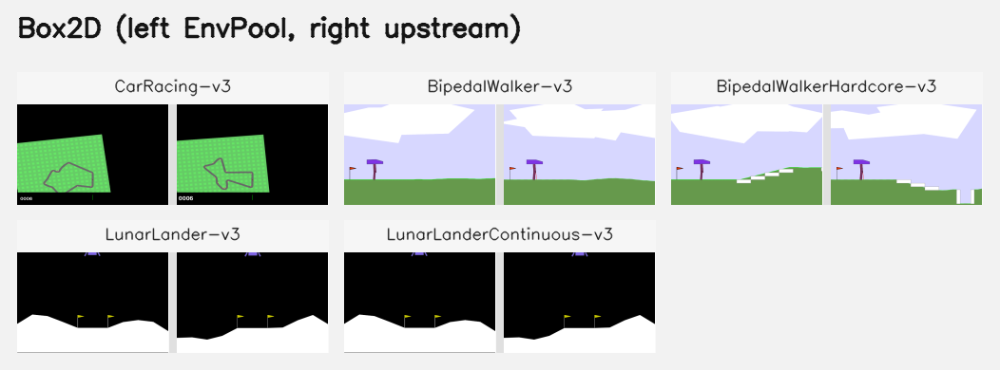

Box2D
=====

EnvPool's Box2D implementation follows ``box2d==2.4.2``. The current Python
baseline checks compare against Gymnasium ``1.2.3`` Box2D environments backed
by the ``box2d`` wheel.

Render Compare
--------------

Representative first-frame compares for Box2D tasks that support rendering. In
each panel, EnvPool is on the left and the Gymnasium reference renderer is on
the right.

BipedalWalker-v3, BipedalWalkerHardcore-v3
------------------------------------------

This is a simple 4-joint walker robot environment. There are two versions:
- Normal, with slightly uneven terrain;
- Hardcore, with ladders, stumps, pitfalls.

To solve the normal version, you need to get 300 points in 1600 time steps.
To solve the hardcore version, you need 300 points in 2000 time steps.

Action Space
~~~~~~~~~~~~

Actions are motor speed values in the ``[-1, 1]`` range for each of the
4 joints at both hips and knees.

Observation Space
~~~~~~~~~~~~~~~~~

State consists of hull angle speed, angular velocity, horizontal speed,
vertical speed, position of joints and joints angular speed, legs contact
with ground, and 10 lidar rangefinder measurements. There are no coordinates
in the state vector.

Rewards
~~~~~~~

Reward is given for moving forward, totaling 300+ points up to the far end.
If the robot falls, it gets -100. Applying motor torque costs a small
amount of points. A more optimal agent will get a better score.

Starting State
~~~~~~~~~~~~~~

The walker starts standing at the left end of the terrain with the hull
horizontal, and both legs in the same position with a slight knee angle.

Episode Termination
~~~~~~~~~~~~~~~~~~~

The episode will terminate if the hull gets in contact with the ground or
if the walker exceeds the right end of the terrain length.

CarRacing-v3
------------

The easiest control task to learn from pixels - a top-down racing environment.
The generated track is random every episode.

Action Space
~~~~~~~~~~~~

There are 3 actions: steering (-1 for full left, 1 for full right), gas
(0 ~ 1), and breaking (0 ~ 1).

Observation Space
~~~~~~~~~~~~~~~~~

State consists of 3 channel 96x96 pixels.

Rewards
~~~~~~~

The reward is -0.1 every frame and +1000/N for every track tile visited, where
N is the total number of tiles visited in the track. For example, if you have
finished in 732 frames, your reward is 1000 - 0.1\*732 = 926.8 points.

Starting State
~~~~~~~~~~~~~~

The car starts at rest in the center of the road.

Episode Termination
~~~~~~~~~~~~~~~~~~~

The episode finishes when all of the tiles are visited. The car can also go
outside of the playfield - that is, far off the track, in which case it will
receive -100 reward and die.

LunarLander-v3, LunarLanderContinuous-v3
----------------------------------------

This environment is a classic rocket trajectory optimization problem.
According to Pontryagin's maximum principle, it is optimal to fire the
engine at full throttle or turn it off. This is the reason why this
environment has discrete actions: engine on or off.

There are two environment versions: discrete or continuous. The landing pad is
always at coordinates (0,0). The coordinates are the first two numbers in the
state vector. Landing outside of the landing pad is possible. Fuel is
infinite, so an agent can learn to fly and then land on its first attempt.

Action Space
~~~~~~~~~~~~

There are four discrete actions available: do nothing, fire left orientation
engine, fire main engine, fire right orientation engine.

Observation Space
~~~~~~~~~~~~~~~~~

There are 8 states: the coordinates of the lander in ``x`` and ``y``, its
linear velocities in ``x`` and ``y``, its angle, its angular velocity, and two
booleans that represent whether each leg is in contact with the ground or not.

Rewards
~~~~~~~

Reward for moving from the top of the screen to the landing pad and coming to
rest is about 100-140 points. If the lander moves away from the landing pad,
it loses reward. If the lander crashes, it receives an additional -100 points.
If it comes to rest, it receives an additional +100 points. Each leg with
ground contact is +10 points. Firing the main engine is -0.3 points each
frame. Firing the side engine is -0.03 points each frame. Solved is 200
points.

Starting State
~~~~~~~~~~~~~~

The lander starts at the top center of the viewport with a random initial
force applied to its center of mass.

Episode Termination
~~~~~~~~~~~~~~~~~~~

The episode finishes if:

1. the lander crashes (the lander body gets in contact with the moon);
2. the lander gets outside of the viewport (``x`` coordinate is greater than
   1);
3. the lander is not awake. From the `Box2D docs
   <https://box2d.org/documentation/md__d_1__git_hub_box2d_docs_dynamics.html#autotoc_md61>`_,
   a body which is not awake is a body which doesn't move and doesn't collide
   with any other body:

   When Box2D determines that a body (or group of bodies) has come to rest,
   the body enters a sleep state which has very little CPU overhead. If a
   body is awake and collides with a sleeping body, then the sleeping body
   wakes up. Bodies will also wake up if a joint or contact attached to
   them is destroyed.

Notes on Box2D versions
-----------------------

``box2d_correctness_test.py`` checks EnvPool against the current Gymnasium
``v3`` Box2D baselines.

Older EnvPool releases used Gym's historical baseline with dependency
``box2d-py==2.3.5`` (see
https://github.com/openai/box2d-py/tree/2.3.5) for these comparisons. If you
need to reproduce that historical setup, please checkout commit
``4de47ebb6615052c67fdfbbe9bc3e9b1d5692f99`` and build the wheel from there.
