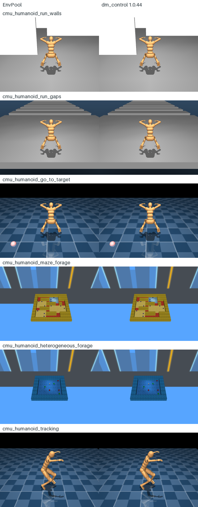
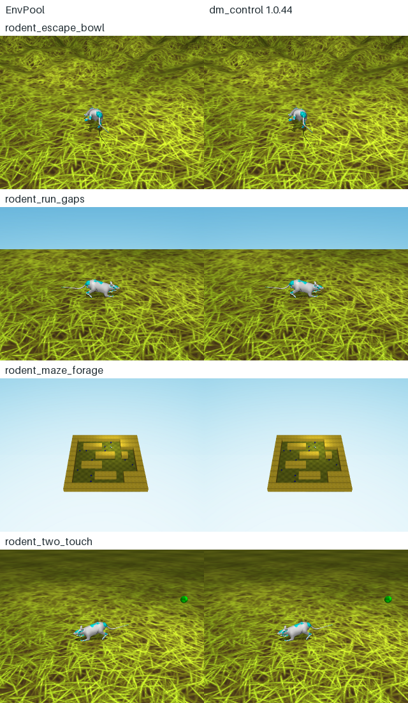
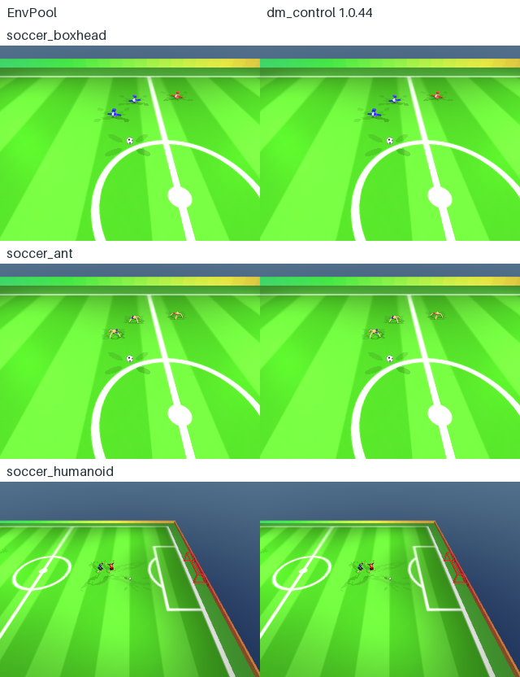

DeepMind Control Locomotion
===========================

EnvPool implements the ten example factories and all three Soccer walker types
from ``dm_control==1.0.44``, using ``mujoco==3.11.0``. These Composer tasks are
separate from :doc:`dm_control`, which implements ``suite.ALL_TASKS``.
The independent ``dm_control.manipulation`` task collection is not included here.

Scene construction, maze generation, terrain generation, motion capture loading,
observations, stepping, rewards, and rendering run in C++. The official Python
package is only an oracle for tests and documentation generation.

Registered tasks
----------------

Each task also has an alias of the form
``dm_control/locomotion/<upstream_factory_name>``. The registry is generated from
the pinned upstream example factories and ``soccer.WalkerType`` enumeration.

.. list-table:: Tasks
   :header-rows: 1
   :widths: 48 12 16 24

   * - EnvPool ID
     - Actions
     - Time limit
     - Task
   * - ``DmcCmuHumanoidRunWalls-v1``
     - 56
     - 30 s
     - Corridor with walls
   * - ``DmcCmuHumanoidRunGaps-v1``
     - 56
     - 30 s
     - Corridor with gaps
   * - ``DmcCmuHumanoidGoToTarget-v1``
     - 56
     - 30 s
     - Reach a target
   * - ``DmcCmuHumanoidMazeForage-v1``
     - 56
     - 30 s
     - Random maze foraging
   * - ``DmcCmuHumanoidHeterogeneousForage-v1``
     - 56
     - 25 s
     - Targets with positive and negative rewards
   * - ``DmcRodentEscapeBowl-v1``
     - 38
     - 20 s
     - Escape a generated terrain bowl
   * - ``DmcRodentRunGaps-v1``
     - 38
     - 30 s
     - Corridor with gaps
   * - ``DmcRodentMazeForage-v1``
     - 38
     - 30 s
     - Random maze foraging
   * - ``DmcRodentTwoTouch-v1``
     - 38
     - 30 s
     - Touch a target twice at the required interval
   * - ``DmcCmuHumanoidTracking-v1``
     - 56
     - 30 s
     - All 36 ``WALK_TINY`` motion capture clips
   * - ``DmcSoccerBoxhead-v1``
     - 3 per player
     - 45 s
     - Soccer with BoxHead walkers
   * - ``DmcSoccerAnt-v1``
     - 8 per player
     - 45 s
     - Soccer with Ant walkers
   * - ``DmcSoccerHumanoid-v1``
     - 56 per player
     - 45 s
     - Soccer with CMU humanoid walkers

All actions are ``float64`` with bounds ``[-1, 1]``. Control time steps are
0.03 s for CMU examples, 0.02 s for rodent examples, and 0.025 s for Soccer.
``time_limit`` overrides the task's limit in seconds; ``max_episode_steps``
can impose a shorter limit in control steps. Failures and task completion can
end an episode earlier. Tracking clip boundaries preserve the upstream
discount of one and set the Gymnasium ``truncated`` flag.

Observations and rendering
--------------------------

Gymnasium observations are dictionaries with the original upstream keys,
including slashes such as ``walker/joints_pos``. The ``dm_env`` API exposes the
same dictionary as ``timestep.observation.obs`` alongside EnvPool's environment
and player identifiers. Shapes and data types match the upstream observation
specification, with the leading EnvPool batch dimension added.

The eight corridor, maze, bowl, and two-touch examples include the upstream
``64 x 64 x 3`` egocentric camera observation. Go-to-target, tracking, and Soccer
expose their upstream state observations. Every task also supports native
``render_mode="rgb_array"`` and batched ``render(env_ids=[...])``. Images are
``uint8`` in height-width-channel order.

.. code-block:: python

   import envpool
   import numpy as np

   env = envpool.make_gymnasium(
       "DmcRodentEscapeBowl-v1",
       num_envs=4,
       seed=0,
       render_mode="rgb_array",
       render_width=320,
       render_height=240,
   )
   observation, info = env.reset()
   observation, reward, terminated, truncated, info = env.step(
       np.zeros((4, 38), dtype=np.float64)
   )
   frames = env.render(env_ids=[3, 1])  # (2, 240, 320, 3)

The following comparisons cover every task after four external action steps,
using one physics-state synchronization immediately after reset. EnvPool is on
the left and the pinned official environment is on the right. The generator
checks every displayed image for pixel equality before writing the figures.

Regenerate the figures with the test-only oracle and the shared MuJoCo engine:

.. code-block:: bash

   bazel run --config=test //envpool/mujoco/locomotion:render_doc -- \
       --output "$PWD/docs/_static/render_samples"

Soccer players
--------------

``team_size`` defaults to two and supports one through eleven players per team.
``max_num_players`` is derived as ``2 * team_size``. Player ordering within each
match is all home players followed by all away players. Actions, observations,
rewards, and discounts use the player batch dimension; ``step_type``,
``terminated``, and ``truncated`` use the match batch dimension. Use
``info["players"]["env_id"]`` (or ``timestep.observation.players.env_id``)
to associate players with their matches.

Soccer retains the upstream singleton observation buffer dimension: for
example, BoxHead joint positions have shape ``(players, 1, 1)``. Rewards are
``float32`` per player, as in the official Soccer API. Single-player Composer
rewards retain ``float64`` precision.

.. code-block:: python

   soccer = envpool.make_gymnasium(
       "DmcSoccerBoxhead-v1", num_envs=8, team_size=2, seed=0
   )
   observation, info = soccer.reset()
   action = np.zeros((32, 3), dtype=np.float64)
   observation, reward, terminated, truncated, info = soccer.step(
       action, env_id=info["env_id"]
   )
   # reward.shape == (32,), terminated.shape == truncated.shape == (8,)

The ``disable_walker_contacts``, ``enable_field_box``, ``keep_aspect_ratio``, and
``terminate_on_goal`` options follow ``soccer.load``. With
``terminate_on_goal=False``, a goal awards the per-team reward and restarts play
inside the same episode. Out-of-bounds balls are returned to play on the next
control step unless the field box is enabled.

Reproducibility and assets
--------------------------

Each environment has independent random streams, including the draws that the
upstream maze and two-touch examples make through NumPy's global random state.
Resetting another environment cannot change its rollout. Seeds are configured
when creating the pool, following the normal EnvPool seed API.

On macOS, Apple's CGL/Metal renderer can return slightly different pixels for
identical model arrays, camera, lights, geometry, and skin vertices and normal
vectors.
This also reproduces with the official renderer alone, with serialized calls
and with dithering, multisampling, or shadows disabled. Visual settings remain
unchanged. The four CMU egocentric cameras allow at most five color levels per
channel and a total absolute error of 20 across the entire 64-by-64 frame;
the rodent maze camera allows one level in one channel. Public renders allow
one level in at most three channels for go-to-target and escape-bowl, four for
tracking, or one for maze and heterogeneous forage. Captured tracking and maze
frames reproduce this variation in repeated official renders with identical
model and used scene arrays; extra draws do not eliminate it. Other images and
all native dynamics/reward replays remain bitwise. These limits are checked per
frame, not averaged over a rollout.

Oracle reward checks retain only small derived-math residuals: tracking's
quaternion/exponential reductions, the bowl's distance norm, and, on Linux
x86-64 only, up to two ULPs in TwoTouch's exponential shaping reward. The
underlying MuJoCo state and discrete task transitions are checked exactly.

On every platform, the oracle builds both pinned MuJoCo and LabMaze's official
1.0.6 Python binding from source with the same toolchain as EnvPool.
LabMaze's seeded layouts depend on the C++ standard library's distribution and
shuffle algorithms, so a published wheel can produce different mazes even on
the same platform. This aligns the native and oracle builds locally; it does
not guarantee identical mazes across platforms. No maze or task algorithm is
patched, and model geometry is checked before reset-state sync.

Official XML, skins, textures, and LabMaze 1.0.6 sources are fetched at build
time. The needed texture styles, model assets, motion clips, and license
notices ship separately in ``envpool-assets>=0.4.1,<0.5.0``, keeping the main
``envpool`` wheel below the PyPI size limit. Source builds use the generated
Bazel assets directly, and the main wheel retains the native code's license
notices. The CMU 2019 clip used to initialize Soccer and all 36 CMU 2020
``WALK_TINY`` clips are
extracted from the official, SHA-256-pinned datasets into approximately 7 MB
of native data. Runtime installation does not download the full motion capture datasets
or require HDF5, SciPy, LabMaze's Python extension, or ``dm_control``.

The source models and tasks are available in the
`official locomotion package <https://github.com/google-deepmind/dm_control/tree/1.0.44/dm_control/locomotion>`_.
Original motion capture data is provided by
`Carnegie Mellon University <http://mocap.cs.cmu.edu/>`_ and fitted to the humanoid
by the dm_control authors. License notices are included with the packaged assets.
