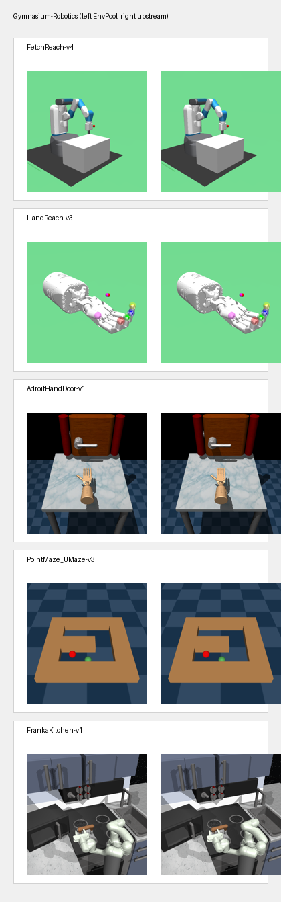

Gymnasium-Robotics
==================

EnvPool provides native C++ implementations for the Gymnasium-Robotics Fetch,
Shadow Hand, Adroit, PointMaze, and FrankaKitchen task families. The Python
package exposes the same ``make_dm``, ``make_gym``, and ``make_gymnasium``
entry points as other EnvPool environments, including batched sync and async
stepping.

Render Compare
--------------

Representative first-frame compares for Gymnasium-Robotics tasks that support
rendering. In each panel, EnvPool is on the left and the official
Gymnasium-Robotics reference renderer is on the right.

Supported Tasks
---------------

EnvPool mirrors Adroit, Fetch, Shadow Hand manipulation/reach, PointMaze, and
FrankaKitchen task IDs from Gymnasium-Robotics. Legacy MuJoCo ``*-v2`` IDs such
as ``Ant-v2`` and ``HalfCheetah-v2`` are intentionally not registered, because
EnvPool already provides the corresponding native MuJoCo
``*-v3``/``*-v4``/``*-v5`` tasks.

For legacy Gymnasium-Robotics IDs that still point to the deprecated
``mujoco_py`` backend upstream, EnvPool transparently routes to the modern
MuJoCo equivalents:

* ``Fetch*`` ``v1`` IDs use the corresponding ``v4`` tasks.
* ``HandManipulate*`` ``v0`` IDs use the corresponding ``v1`` tasks.
* ``HandReach-v0`` and ``HandReachDense-v0`` use the corresponding ``v3``
  tasks.

Registered Task IDs
-------------------

Fetch
~~~~~

.. code-block:: text

    FetchReach-v1
    FetchReach-v4
    FetchReachDense-v1
    FetchReachDense-v4
    FetchPush-v1
    FetchPush-v4
    FetchPushDense-v1
    FetchPushDense-v4
    FetchPickAndPlace-v1
    FetchPickAndPlace-v4
    FetchPickAndPlaceDense-v1
    FetchPickAndPlaceDense-v4
    FetchSlide-v1
    FetchSlide-v4
    FetchSlideDense-v1
    FetchSlideDense-v4

Shadow Hand
~~~~~~~~~~~

.. code-block:: text

    HandReach-v0
    HandReach-v3
    HandReachDense-v0
    HandReachDense-v3
    HandManipulateBlock-v0
    HandManipulateBlock-v1
    HandManipulateBlockDense-v0
    HandManipulateBlockDense-v1
    HandManipulateBlockFull-v0
    HandManipulateBlockFull-v1
    HandManipulateBlockFullDense-v0
    HandManipulateBlockFullDense-v1
    HandManipulateBlockRotateParallel-v0
    HandManipulateBlockRotateParallel-v1
    HandManipulateBlockRotateParallelDense-v0
    HandManipulateBlockRotateParallelDense-v1
    HandManipulateBlockRotateXYZ-v0
    HandManipulateBlockRotateXYZ-v1
    HandManipulateBlockRotateXYZDense-v0
    HandManipulateBlockRotateXYZDense-v1
    HandManipulateBlockRotateZ-v0
    HandManipulateBlockRotateZ-v1
    HandManipulateBlockRotateZDense-v0
    HandManipulateBlockRotateZDense-v1
    HandManipulateBlock_BooleanTouchSensors-v0
    HandManipulateBlock_BooleanTouchSensors-v1
    HandManipulateBlock_BooleanTouchSensorsDense-v0
    HandManipulateBlock_BooleanTouchSensorsDense-v1
    HandManipulateBlock_ContinuousTouchSensors-v0
    HandManipulateBlock_ContinuousTouchSensors-v1
    HandManipulateBlock_ContinuousTouchSensorsDense-v0
    HandManipulateBlock_ContinuousTouchSensorsDense-v1
    HandManipulateBlockRotateParallel_BooleanTouchSensors-v0
    HandManipulateBlockRotateParallel_BooleanTouchSensors-v1
    HandManipulateBlockRotateParallel_BooleanTouchSensorsDense-v0
    HandManipulateBlockRotateParallel_BooleanTouchSensorsDense-v1
    HandManipulateBlockRotateParallel_ContinuousTouchSensors-v0
    HandManipulateBlockRotateParallel_ContinuousTouchSensors-v1
    HandManipulateBlockRotateParallel_ContinuousTouchSensorsDense-v0
    HandManipulateBlockRotateParallel_ContinuousTouchSensorsDense-v1
    HandManipulateBlockRotateXYZ_BooleanTouchSensors-v0
    HandManipulateBlockRotateXYZ_BooleanTouchSensors-v1
    HandManipulateBlockRotateXYZ_BooleanTouchSensorsDense-v0
    HandManipulateBlockRotateXYZ_BooleanTouchSensorsDense-v1
    HandManipulateBlockRotateXYZ_ContinuousTouchSensors-v0
    HandManipulateBlockRotateXYZ_ContinuousTouchSensors-v1
    HandManipulateBlockRotateXYZ_ContinuousTouchSensorsDense-v0
    HandManipulateBlockRotateXYZ_ContinuousTouchSensorsDense-v1
    HandManipulateBlockRotateZ_BooleanTouchSensors-v0
    HandManipulateBlockRotateZ_BooleanTouchSensors-v1
    HandManipulateBlockRotateZ_BooleanTouchSensorsDense-v0
    HandManipulateBlockRotateZ_BooleanTouchSensorsDense-v1
    HandManipulateBlockRotateZ_ContinuousTouchSensors-v0
    HandManipulateBlockRotateZ_ContinuousTouchSensors-v1
    HandManipulateBlockRotateZ_ContinuousTouchSensorsDense-v0
    HandManipulateBlockRotateZ_ContinuousTouchSensorsDense-v1
    HandManipulateEgg-v0
    HandManipulateEgg-v1
    HandManipulateEggDense-v0
    HandManipulateEggDense-v1
    HandManipulateEggFull-v0
    HandManipulateEggFull-v1
    HandManipulateEggFullDense-v0
    HandManipulateEggFullDense-v1
    HandManipulateEggRotate-v0
    HandManipulateEggRotate-v1
    HandManipulateEggRotateDense-v0
    HandManipulateEggRotateDense-v1
    HandManipulateEgg_BooleanTouchSensors-v0
    HandManipulateEgg_BooleanTouchSensors-v1
    HandManipulateEgg_BooleanTouchSensorsDense-v0
    HandManipulateEgg_BooleanTouchSensorsDense-v1
    HandManipulateEgg_ContinuousTouchSensors-v0
    HandManipulateEgg_ContinuousTouchSensors-v1
    HandManipulateEgg_ContinuousTouchSensorsDense-v0
    HandManipulateEgg_ContinuousTouchSensorsDense-v1
    HandManipulateEggRotate_BooleanTouchSensors-v0
    HandManipulateEggRotate_BooleanTouchSensors-v1
    HandManipulateEggRotate_BooleanTouchSensorsDense-v0
    HandManipulateEggRotate_BooleanTouchSensorsDense-v1
    HandManipulateEggRotate_ContinuousTouchSensors-v0
    HandManipulateEggRotate_ContinuousTouchSensors-v1
    HandManipulateEggRotate_ContinuousTouchSensorsDense-v0
    HandManipulateEggRotate_ContinuousTouchSensorsDense-v1
    HandManipulatePen-v0
    HandManipulatePen-v1
    HandManipulatePenDense-v0
    HandManipulatePenDense-v1
    HandManipulatePenFull-v0
    HandManipulatePenFull-v1
    HandManipulatePenFullDense-v0
    HandManipulatePenFullDense-v1
    HandManipulatePenRotate-v0
    HandManipulatePenRotate-v1
    HandManipulatePenRotateDense-v0
    HandManipulatePenRotateDense-v1
    HandManipulatePen_BooleanTouchSensors-v0
    HandManipulatePen_BooleanTouchSensors-v1
    HandManipulatePen_BooleanTouchSensorsDense-v0
    HandManipulatePen_BooleanTouchSensorsDense-v1
    HandManipulatePen_ContinuousTouchSensors-v0
    HandManipulatePen_ContinuousTouchSensors-v1
    HandManipulatePen_ContinuousTouchSensorsDense-v0
    HandManipulatePen_ContinuousTouchSensorsDense-v1
    HandManipulatePenRotate_BooleanTouchSensors-v0
    HandManipulatePenRotate_BooleanTouchSensors-v1
    HandManipulatePenRotate_BooleanTouchSensorsDense-v0
    HandManipulatePenRotate_BooleanTouchSensorsDense-v1
    HandManipulatePenRotate_ContinuousTouchSensors-v0
    HandManipulatePenRotate_ContinuousTouchSensors-v1
    HandManipulatePenRotate_ContinuousTouchSensorsDense-v0
    HandManipulatePenRotate_ContinuousTouchSensorsDense-v1

Adroit
~~~~~~

.. code-block:: text

    AdroitHandDoor-v1
    AdroitHandDoorSparse-v1
    AdroitHandHammer-v1
    AdroitHandHammerSparse-v1
    AdroitHandPen-v1
    AdroitHandPenSparse-v1
    AdroitHandRelocate-v1
    AdroitHandRelocateSparse-v1

PointMaze
~~~~~~~~~

.. code-block:: text

    PointMaze_Open-v3
    PointMaze_OpenDense-v3
    PointMaze_UMaze-v3
    PointMaze_UMazeDense-v3
    PointMaze_Medium-v3
    PointMaze_MediumDense-v3
    PointMaze_Large-v3
    PointMaze_LargeDense-v3
    PointMaze_Open_Diverse_G-v3
    PointMaze_Open_Diverse_GDense-v3
    PointMaze_Open_Diverse_GR-v3
    PointMaze_Open_Diverse_GRDense-v3
    PointMaze_Medium_Diverse_G-v3
    PointMaze_Medium_Diverse_GDense-v3
    PointMaze_Medium_Diverse_GR-v3
    PointMaze_Medium_Diverse_GRDense-v3
    PointMaze_Large_Diverse_G-v3
    PointMaze_Large_Diverse_GDense-v3
    PointMaze_Large_Diverse_GR-v3
    PointMaze_Large_Diverse_GRDense-v3

Kitchen
~~~~~~~

.. code-block:: text

    FrankaKitchen-v1

Examples
--------

.. code-block:: python

    import envpool

    env = envpool.make_gymnasium("FetchReach-v4", num_envs=4, seed=0)
    obs, info = env.reset()
    obs, rew, term, trunc, info = env.step(env.action_space.sample()[None, :].repeat(4, axis=0))
    frame = env.render()
    env.close()

Notes
-----

``FrankaKitchen-v1`` uses a fixed all-task observation schema in EnvPool so
that the C++ state specification remains static. The returned ``info`` values
for ``tasks_to_complete``, ``step_task_completions``, and
``episode_task_completions`` are 7-dimensional masks ordered as
``bottom burner``, ``top burner``, ``light switch``, ``slide cabinet``,
``hinge cabinet``, ``microwave``, and ``kettle``.
