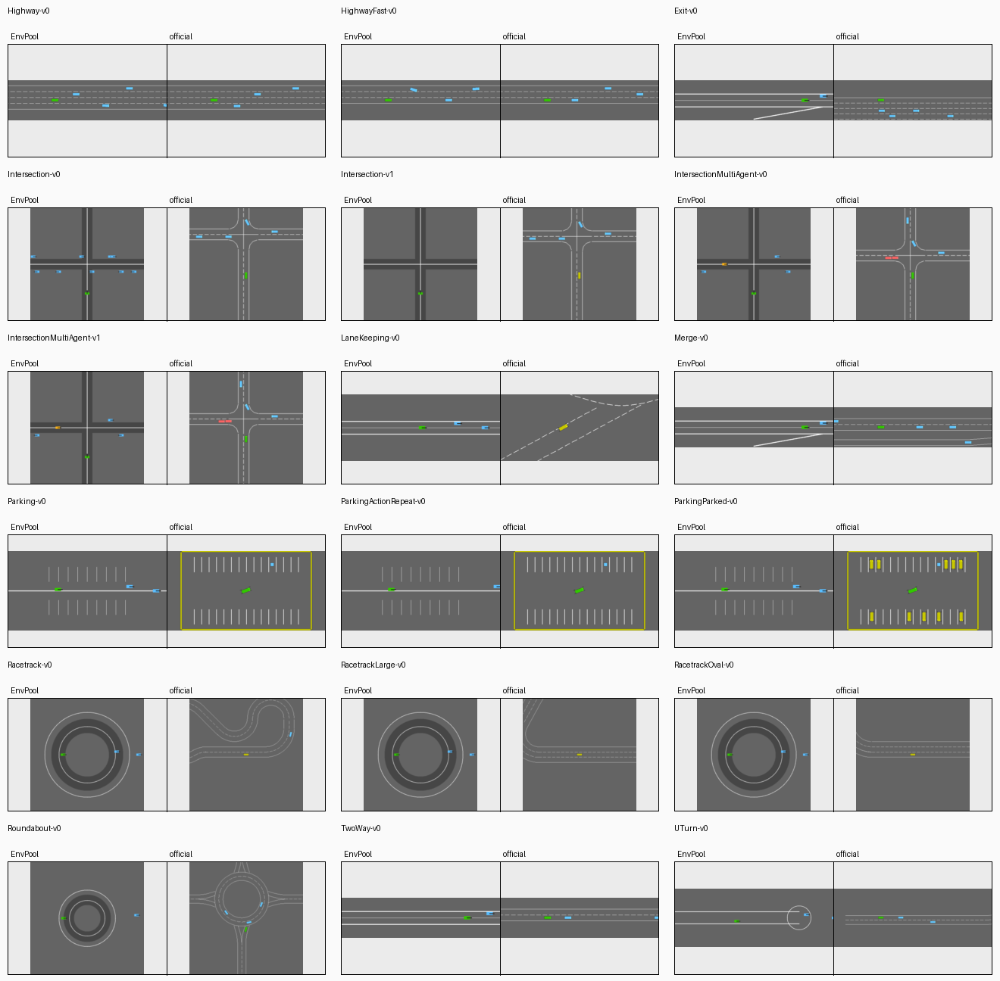

Highway
#######

EnvPool supports the tasks registered by `highway-env
<https://github.com/Farama-Foundation/HighwayEnv>`_. The implementation is
native C++ inside EnvPool; it does not call back into the upstream Python
environment at runtime. ``highway-v0`` and ``highway-fast-v0`` use the aligned
straight-road C++ backend, and the remaining upstream IDs use native EnvPool
task backends with matching public observation/action spaces.

Render Compare
--------------

Representative render compares for all upstream Highway tasks after reset and
two idle/default actions.
Each panel shows EnvPool on the left and the official ``highway-env`` pygame
renderer on the right.

Options
-------

* ``task_id (str)``: any task listed in `Available Tasks`_;
* ``num_envs (int)``: how many environments you would like to create;
* ``batch_size (int)``: the expected batch size for return result, default to
  ``num_envs``;
* ``num_threads (int)``: the maximum thread number for executing the actual
  ``env.step``, default to ``batch_size``;
* ``seed (int | Sequence[int])``: the environment seed. When a sequence is
  provided, it must contain exactly one seed per environment. Default to
  ``42``;

``Highway-v0`` and ``HighwayFast-v0`` additionally expose these straight-road
options:

* ``max_episode_steps (int)``: the maximum number of policy decisions in one
  episode. ``Highway-v0`` defaults to ``40`` and ``HighwayFast-v0`` defaults
  to ``30``;
* ``lanes_count (int)``: number of parallel lanes, default to ``4``;
* ``vehicles_count (int)``: number of traffic vehicles, default to ``50``;
* ``observation_vehicles_count (int)``: number of rows in the kinematic
  observation, default to ``5``;
* ``simulation_frequency (int)``: physics update frequency in Hertz, default
  to ``15``;
* ``policy_frequency (int)``: agent action frequency in Hertz, default to
  ``1``;
* ``initial_lane_id (int)``: fixed ego start lane, or ``-1`` for a random
  start lane;
* ``ego_spacing (float)`` and ``vehicles_density (float)``: initial traffic
  spacing controls;
* ``collision_reward (float)``, ``right_lane_reward (float)``,
  ``high_speed_reward (float)``, ``reward_speed_low (float)``,
  ``reward_speed_high (float)``, and ``normalize_reward (bool)``: reward
  shaping options;
* ``offroad_terminal (bool)``: terminate when the ego vehicle leaves the road,
  default to ``False``;
* ``screen_width (int)``, ``screen_height (int)``,
  ``centering_position_x (float)``, ``centering_position_y (float)``, and
  ``scaling (float)``: renderer camera options.

Observation Space
-----------------

For ``Highway-v0`` and ``HighwayFast-v0``, the Gymnasium wrapper returns a
``(observation_vehicles_count, 5)`` float array. Columns follow upstream's
kinematic observation convention:
``presence``, ``x``, ``y``, ``vx``, and ``vy``. Coordinates are centered on the
ego vehicle and normalized to roughly ``[-1, 1]``.

These tasks also expose two info fields:

* ``info["speed"]``: ego vehicle speed in meters per second;
* ``info["crashed"]``: whether the ego vehicle has crashed.

Action Space
------------

For ``Highway-v0`` and ``HighwayFast-v0``, the action space is discrete with
five meta-actions:

* ``0``: ``LANE_LEFT``
* ``1``: ``IDLE``
* ``2``: ``LANE_RIGHT``
* ``3``: ``FASTER``
* ``4``: ``SLOWER``

Available Tasks
---------------

* ``Highway-v0``; alias: ``highway-v0``
* ``HighwayFast-v0``; alias: ``highway-fast-v0``
* ``Exit-v0``; alias: ``exit-v0``
* ``Intersection-v0``; alias: ``intersection-v0``
* ``Intersection-v1``; alias: ``intersection-v1``
* ``IntersectionMultiAgent-v0``; alias: ``intersection-multi-agent-v0``
* ``IntersectionMultiAgent-v1``; alias: ``intersection-multi-agent-v1``
* ``LaneKeeping-v0``; alias: ``lane-keeping-v0``
* ``Merge-v0``; alias: ``merge-v0``
* ``Parking-v0``; alias: ``parking-v0``
* ``ParkingActionRepeat-v0``; alias: ``parking-ActionRepeat-v0``
* ``ParkingParked-v0``; alias: ``parking-parked-v0``
* ``Racetrack-v0``; alias: ``racetrack-v0``
* ``RacetrackLarge-v0``; alias: ``racetrack-large-v0``
* ``RacetrackOval-v0``; alias: ``racetrack-oval-v0``
* ``Roundabout-v0``; alias: ``roundabout-v0``
* ``TwoWay-v0``; alias: ``two-way-v0``
* ``UTurn-v0``; alias: ``u-turn-v0``

Correctness Tests
-----------------

The test suite uses these pass standards:

* Native straight-road rollout determinism: two EnvPool instances with the same
  seed and action sequence must match, while a different seed must change the
  rollout;
* Full-task native determinism: every upstream registered ID is reset and
  stepped for multiple policy decisions in two same-seed EnvPool instances;
  observation trees, rewards, done flags, info trees, and renders must match
  bitwise;
* Native controlled-vehicle alignment: no-traffic ``Highway-v0`` and
  ``HighwayFast-v0`` observations are checked bitwise against official
  ``highway-env`` for several road and policy-frequency setups. Rewards,
  ``terminated``, ``truncated``, ``info["speed"]``, and
  ``info["crashed"]`` are checked exactly at EnvPool's exported dtype;
* Native render alignment: multi-step no-traffic RGB renders and representative
  reset traffic renders are checked bitwise against the official pygame
  renderer. Rendering must also be batched and state-invariant;
* Full upstream registry coverage: the test pins the 18 registered upstream
  IDs, checks EnvPool's Gymnasium observation/action spaces against an
  independent official ``highway-env`` oracle, creates EnvPool through each
  upstream ID/alias, resets, steps more than once, and renders more than once;
* Implementation boundary: tests and doc tooling may import official
  ``highway-env`` as an oracle, but the EnvPool implementation is built as C++
  code and has no official Python-environment bridge.
