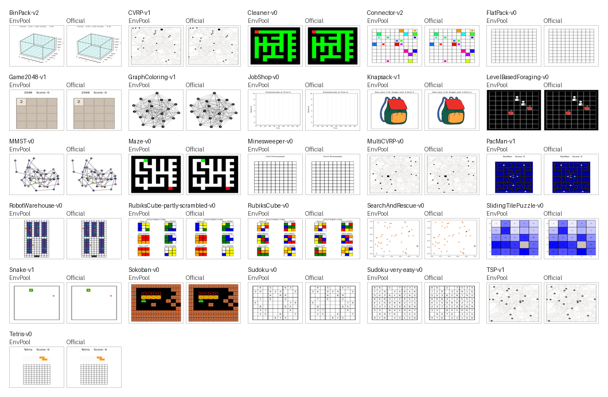

Jumanji
========

EnvPool provides native C++ batched implementations for the public task IDs in
``jumanji==1.1.1``.

Render Compare
--------------

Representative reset-frame renders for all Jumanji tasks. Each panel shows
EnvPool ``env.render()`` on the left and the pinned official
``jumanji==1.1.1`` Matplotlib renderer on the right. The generation script
resets the official oracle first, passes the supported reset-state fields into
EnvPool, and writes the side-by-side comparison image from those synchronized
reset states.

Options
-------

* ``task_id (str)``: see available tasks below;
* ``num_envs (int)``: how many environments you would like to create;
* ``batch_size (int)``: the expected batch size for return result, default to
  ``num_envs``;
* ``num_threads (int)``: the maximum thread number for executing the actual
  ``env.step``, default to ``batch_size``;
* ``seed (int | Sequence[int])``: the environment seed. When a sequence is
  provided, it must contain exactly one seed per environment. Default to
  ``42``;
* ``max_episode_steps (int)``: the maximum number of steps for one episode.

Supported Tasks
---------------

* ``BinPack-v2``
* ``CVRP-v1``
* ``Cleaner-v0``
* ``Connector-v2``
* ``FlatPack-v0``
* ``Game2048-v1``
* ``GraphColoring-v1``
* ``JobShop-v0``
* ``Knapsack-v1``
* ``LevelBasedForaging-v0``
* ``MMST-v0``
* ``Maze-v0``
* ``Minesweeper-v0``
* ``MultiCVRP-v0``
* ``PacMan-v1``
* ``RobotWarehouse-v0``
* ``RubiksCube-partly-scrambled-v0``
* ``RubiksCube-v0``
* ``SearchAndRescue-v0``
* ``SlidingTilePuzzle-v0``
* ``Snake-v1``
* ``Sokoban-v0``
* ``Sudoku-v0``
* ``Sudoku-very-easy-v0``
* ``TSP-v1``
* ``Tetris-v0``

Example
-------

.. code-block:: python

   import envpool

   env = envpool.make_gymnasium("Sokoban-v0", num_envs=8, seed=0)
   obs, info = env.reset()
