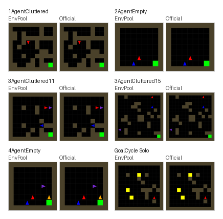

MarlGrid
========

We use ``kandouss/marlgrid`` commit
``e88c40bad07653575ac11fe2f3a115e4de3d13e9`` as the reference implementation.
MarlGrid is a multi-agent gridworld based on the original MiniGrid codebase.
Its GoalCycle environments were used in the 2021 paper by Ndousse and
coauthors, `Emergent Social Learning via Multi-agent Reinforcement Learning
<https://proceedings.mlr.press/v139/ndousse21a.html>`_.

Options
-------

* ``task_id (str)``: see the available tasks below;
* ``num_envs (int)``: how many environments you would like to create;
* ``batch_size (int)``: the expected batch size for returned environments,
  default to ``num_envs``;
* ``num_threads (int)``: the maximum thread number for executing the actual
  ``env.step``, default to ``batch_size``;
* ``seed (int | Sequence[int])``: the environment seed. When a sequence is
  provided, it must contain exactly one seed per environment. Default to
  ``42``;
* ``max_num_players (int)``: maximum number of players in one environment.
  Each registered task defaults this to its number of agents;
* ``prestige_coloring (bool)``: use the ``kandouss/marlgrid`` prestige cue for
  agent rendering. This option defaults to ``False`` to preserve the fixed
  agent colors used by existing tasks. When enabled, positive rewards move an
  agent color from red toward blue, negative rewards reset it to red, and
  prestige decays after each active agent step;
* ``prestige_beta (float)``: per-step prestige decay factor, default to
  ``0.95``;
* ``prestige_scale (float)``: reward-history scale used when mapping prestige
  to color, default to ``2.0``;
* ``observation_format (str)``: observation representation. ``"pixels"``
  (default) returns the existing RGB partial view, ``"matrix"`` returns an
  egocentric semantic partial view, and ``"full_matrix"`` returns the
  world-oriented semantic grid.

Observation Space
-----------------

MarlGrid returns one uint8 observation per player. Its shape depends on
``observation_format``:

* ``pixels``: ``(view_tile_size * view_size, view_tile_size * view_size, 3)``.
  This is the existing RGB partial view. The default registered tasks use
  ``view_tile_size=8``;
* ``matrix``: ``(view_size, view_size, 13)``. This is the agent's egocentric
  partial view. Occluded cells and every cell for an inactive player are all
  zero;
* ``full_matrix``: ``(grid_size, grid_size, 13)``. This is the global grid in
  world coordinates. Every cell for an inactive player is zero.

For both matrix formats, channels are:

* ``0``--``4``: one-hot empty, wall, goal, bonus, and lava base tiles;
* ``5``: agent presence;
* ``6``--``8``: agent red, green, and blue values. These contain the prestige
  color when ``prestige_coloring=True``;
* ``9``--``12``: one-hot agent direction: right, down, left, and up.

One visible base-tile channel and every active one-hot channel use value
``255``. An agent can occupy a base object, so base-tile and agent channels may
both be set. Directions in ``matrix`` use the rotated egocentric coordinates;
directions in ``full_matrix`` use world coordinates.

Player metadata is returned under ``info["players"]``:

* ``id``: player index inside the environment;
* ``done``: per-player completion flag;
* ``active``: whether the player currently renders and acts;
* ``pos``: player position in the full grid;
* ``dir``: player direction in ``[0, 3]``.

Action Space
------------

Actions are per-player discrete values in ``[0, 6]``:

* ``0``: turn left;
* ``1``: turn right;
* ``2``: move forward;
* ``3``: pick up;
* ``4``: drop;
* ``5``: toggle / interact;
* ``6``: done.

Multi-agent tasks accept EnvPool's player-shaped action format, for example:

.. code-block:: python

   import envpool
   import numpy as np

   env = envpool.make_gymnasium("MarlGrid-3AgentCluttered11x11-v0", num_envs=2)
   obs, info = env.reset()
   obs, reward, terminated, truncated, info = env.step({
       "players": {
           "env_id": info["players"]["env_id"],
           "action": np.full(info["players"]["env_id"].shape, 2, dtype=np.int32),
       }
   })

Available Tasks
---------------

Task IDs follow the pinned upstream registry. Note that upstream names
``MarlGrid-1AgentCluttered15x15-v0`` as ``15x15`` even though that pinned
registry config uses ``grid_size=11``.

* ``MarlGrid-1AgentCluttered15x15-v0``
* ``MarlGrid-3AgentCluttered11x11-v0``
* ``MarlGrid-3AgentCluttered15x15-v0``
* ``MarlGrid-2AgentEmpty9x9-v0``
* ``MarlGrid-3AgentEmpty9x9-v0``
* ``MarlGrid-4AgentEmpty9x9-v0``
* ``Goalcycle-demo-solo-v0``
