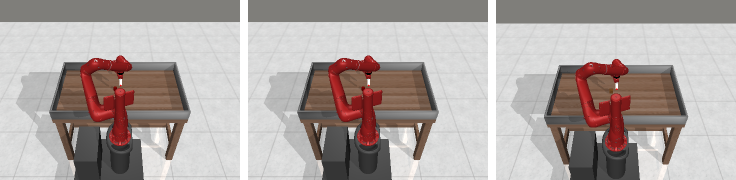

MetaWorld
=========

EnvPool provides native C++ implementations for the MetaWorld v3 Sawyer
manipulation benchmark. The implementation is pinned to
``Farama-Foundation/Metaworld`` tag ``v3.0.0`` and exposes one EnvPool task ID
for each official ``ALL_V3_ENVIRONMENTS`` entry.

The public task IDs use the ``MetaWorld/`` prefix, for example
``MetaWorld/reach-v3``. The legacy spelling ``Meta-World/`` is also registered
as an alias for each task.

Observation and Action Spaces
-----------------------------

All MetaWorld v3 tasks share the same public space contract:

* Observation space: ``Box(-inf, inf, shape=(39,), dtype=float64)``. The vector
  contains the current 18-dimensional Sawyer observation, the previous
  18-dimensional observation, and the 3-dimensional goal vector.
* Action space: ``Box(-1, 1, shape=(4,), dtype=float32)``. The first three
  components control hand displacement and the last component controls the
  gripper.
* ``frame_skip``: 5.
* ``max_episode_steps``: 500.

Render
------

Representative native EnvPool render frames for ``reach-v3``,
``pick-place-v3``, and ``sweep-v3`` are shown below from left to right.

Registered Task IDs
-------------------

.. code-block:: text

    MetaWorld/assembly-v3
    MetaWorld/basketball-v3
    MetaWorld/bin-picking-v3
    MetaWorld/box-close-v3
    MetaWorld/button-press-topdown-v3
    MetaWorld/button-press-topdown-wall-v3
    MetaWorld/button-press-v3
    MetaWorld/button-press-wall-v3
    MetaWorld/coffee-button-v3
    MetaWorld/coffee-pull-v3
    MetaWorld/coffee-push-v3
    MetaWorld/dial-turn-v3
    MetaWorld/disassemble-v3
    MetaWorld/door-close-v3
    MetaWorld/door-lock-v3
    MetaWorld/door-open-v3
    MetaWorld/door-unlock-v3
    MetaWorld/hand-insert-v3
    MetaWorld/drawer-close-v3
    MetaWorld/drawer-open-v3
    MetaWorld/faucet-open-v3
    MetaWorld/faucet-close-v3
    MetaWorld/hammer-v3
    MetaWorld/handle-press-side-v3
    MetaWorld/handle-press-v3
    MetaWorld/handle-pull-side-v3
    MetaWorld/handle-pull-v3
    MetaWorld/lever-pull-v3
    MetaWorld/pick-place-wall-v3
    MetaWorld/pick-out-of-hole-v3
    MetaWorld/pick-place-v3
    MetaWorld/plate-slide-v3
    MetaWorld/plate-slide-side-v3
    MetaWorld/plate-slide-back-v3
    MetaWorld/plate-slide-back-side-v3
    MetaWorld/peg-insert-side-v3
    MetaWorld/peg-unplug-side-v3
    MetaWorld/soccer-v3
    MetaWorld/stick-push-v3
    MetaWorld/stick-pull-v3
    MetaWorld/push-v3
    MetaWorld/push-wall-v3
    MetaWorld/push-back-v3
    MetaWorld/reach-v3
    MetaWorld/reach-wall-v3
    MetaWorld/shelf-place-v3
    MetaWorld/sweep-into-v3
    MetaWorld/sweep-v3
    MetaWorld/window-open-v3
    MetaWorld/window-close-v3

Validation
----------

The native implementation is checked against the official MetaWorld v3.0.0
Python oracle. The alignment test reset-syncs MuJoCo state once, then drives
both implementations with the same external action sequence and compares
observations, rewards, termination flags, truncation flags, and exposed info
fields. Separate tests cover registry completeness, deterministic rollouts, and
``rgb_array`` rendering for every registered task.
