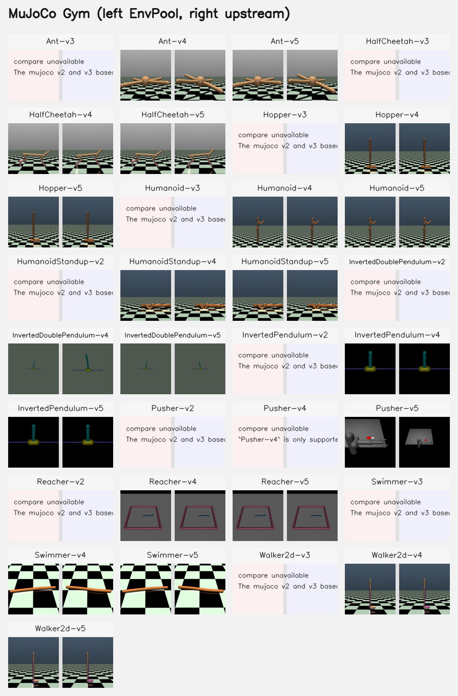

Mujoco (gym)
============

We use ``mujoco==3.6.0`` as the codebase.
See https://github.com/google-deepmind/mujoco/tree/3.6.0

The implementation follows Gymnasium \*-v4/\*-v5 environments, see
`reference <https://github.com/Farama-Foundation/Gymnasium/tree/v1.2.3/gymnasium/envs/mujoco>`_.

EnvPool exposes the current official Gymnasium task IDs (\*-v4 and \*-v5) and
keeps the historical \*-v2/\*-v3 IDs as backward-compatible aliases where they
existed previously.
Set ``post_constraint=False`` to match the pre-v5 observation behavior where
applicable.

Render Compare
--------------

Representative first-frame compares for MuJoCo gym tasks that support
rendering. In each panel, EnvPool is on the left and the Gymnasium reference
renderer is on the right.

Ant-v4/v5
---------

`gymnasium Ant-v4 source code
<https://github.com/Farama-Foundation/Gymnasium/blob/v1.2.3/gymnasium/envs/mujoco/ant_v4.py>`_

`gymnasium Ant-v5 source code
<https://github.com/Farama-Foundation/Gymnasium/blob/v1.2.3/gymnasium/envs/mujoco/ant_v5.py>`_

- Observation space (v4/v5): ``(27)``, first 13 elements for ``qpos[2:]``,
  next 14 elements for ``qvel``;
- Action space: ``(8)``, with range ``[-1, 1]``;
- ``frame_skip``: 5;
- ``max_episode_steps``: 1000;
- ``reward_threshold``: 6000.0;

The legacy ``Ant-v3`` alias keeps the historical 111-dimensional observation
that includes clipped ``cfrc_ext`` contact-force features.

HalfCheetah-v4/v5
-----------------

`gymnasium HalfCheetah-v4 source code
<https://github.com/Farama-Foundation/Gymnasium/blob/v1.2.3/gymnasium/envs/mujoco/half_cheetah_v4.py>`_

`gymnasium HalfCheetah-v5 source code
<https://github.com/Farama-Foundation/Gymnasium/blob/v1.2.3/gymnasium/envs/mujoco/half_cheetah_v5.py>`_

- Observation space: ``(17)``, first 8 elements for ``qpos[1:]``, next 9
  elements for ``qvel``;
- Action space: ``(6)``, with range ``[-1, 1]``;
- ``frame_skip``: 5;
- ``max_episode_steps``: 1000;
- ``reward_threshold``: 4800.0;

Hopper-v4/v5
------------

`gymnasium Hopper-v4 source code
<https://github.com/Farama-Foundation/Gymnasium/blob/v1.2.3/gymnasium/envs/mujoco/hopper_v4.py>`_

`gymnasium Hopper-v5 source code
<https://github.com/Farama-Foundation/Gymnasium/blob/v1.2.3/gymnasium/envs/mujoco/hopper_v5.py>`_

- Observation space: ``(11)``, first 5 elements for ``qpos[1:]``, next 6
  elements for ``qvel``;
- Action space: ``(3)``, with range ``[-1, 1]``;
- ``frame_skip``: 4;
- ``max_episode_steps``: 1000;
- ``reward_threshold``: 6000.0;

Humanoid-v4/v5, HumanoidStandup-v4/v5
-------------------------------------

`gymnasium Humanoid-v4 source code
<https://github.com/Farama-Foundation/Gymnasium/blob/v1.2.3/gymnasium/envs/mujoco/humanoid_v4.py>`_

`gymnasium Humanoid-v5 source code
<https://github.com/Farama-Foundation/Gymnasium/blob/v1.2.3/gymnasium/envs/mujoco/humanoid_v5.py>`_

`gymnasium HumanoidStandup-v4 source code
<https://github.com/Farama-Foundation/Gymnasium/blob/v1.2.3/gymnasium/envs/mujoco/humanoidstandup_v4.py>`_

`gymnasium HumanoidStandup-v5 source code
<https://github.com/Farama-Foundation/Gymnasium/blob/v1.2.3/gymnasium/envs/mujoco/humanoidstandup_v5.py>`_

- Observation space: ``(376)``, first 22 elements for ``qpos[2:]``, next 23
  elements for ``qvel``, next 140 elements for ``cinert`` (com-based body
  inertia and mass), next 84 elements for ``cvel`` (com-based velocity [3D
  rot; 3D tran]), next 23 elements for ``qfrc_actuator`` (actuator force),
  next 84 elements for ``cfrc_ext`` (com-based external force on body);
- Action space: ``(17)``, with range ``[-0.4, 0.4]``;
- ``frame_skip``: 5;
- ``max_episode_steps``: 1000;

InvertedDoublePendulum-v4/v5
----------------------------

`gymnasium InvertedDoublePendulum-v4 source code
<https://github.com/Farama-Foundation/Gymnasium/blob/v1.2.3/gymnasium/envs/mujoco/inverted_double_pendulum_v4.py>`_

`gymnasium InvertedDoublePendulum-v5 source code
<https://github.com/Farama-Foundation/Gymnasium/blob/v1.2.3/gymnasium/envs/mujoco/inverted_double_pendulum_v5.py>`_

- Observation space: ``(11)``, first 1 element for ``qpos[0]``, next 2
  elements for ``sin(qpos[1:])``, next 2 elements for ``cos(qpos[1:])``,
  next 3 elements for ``qvel``, next 3 elements for ``qfrc_constraint``;
- Action space: ``(1)``, with range ``[-1, 1]``;
- ``frame_skip``: 5;
- ``max_episode_steps``: 1000;
- ``reward_threshold``: 9100.0;

InvertedPendulum-v4/v5
----------------------

`gymnasium InvertedPendulum-v4 source code
<https://github.com/Farama-Foundation/Gymnasium/blob/v1.2.3/gymnasium/envs/mujoco/inverted_pendulum_v4.py>`_

`gymnasium InvertedPendulum-v5 source code
<https://github.com/Farama-Foundation/Gymnasium/blob/v1.2.3/gymnasium/envs/mujoco/inverted_pendulum_v5.py>`_

- Observation space: ``(4)``, first 2 elements for ``qpos``, next 2 elements
  for ``qvel``;
- Action space: ``(1)``, with range ``[-3, 3]``;
- ``frame_skip``: 2;
- ``max_episode_steps``: 1000;
- ``reward_threshold``: 950.0;

Pusher-v4/v5
------------

`gymnasium Pusher-v4 source code
<https://github.com/Farama-Foundation/Gymnasium/blob/v1.2.3/gymnasium/envs/mujoco/pusher_v4.py>`_

`gymnasium Pusher-v5 source code
<https://github.com/Farama-Foundation/Gymnasium/blob/v1.2.3/gymnasium/envs/mujoco/pusher_v5.py>`_

- Observation space: ``(23)``, first 7 elements for ``qpos[:7]``, next 7
  elements for ``qvel[:7]``, next 3 elements for ``tips_arm``, next 3
  elements for ``object``, next 3 elements for ``goal``;
- Action space: ``(7)``, with range ``[-2, 2]``;
- ``frame_skip``: 5;
- ``max_episode_steps``: 100;
- ``reward_threshold``: 0.0;

Gymnasium's official ``Pusher-v4`` reference env raises ``ImportError`` under
``mujoco>=3``. EnvPool still exposes the official task ID for compatibility,
and the parity test only validates space alignment when Gymnasium's reference
can be instantiated.

Reacher-v4/v5
-------------

`gymnasium Reacher-v4 source code
<https://github.com/Farama-Foundation/Gymnasium/blob/v1.2.3/gymnasium/envs/mujoco/reacher_v4.py>`_

`gymnasium Reacher-v5 source code
<https://github.com/Farama-Foundation/Gymnasium/blob/v1.2.3/gymnasium/envs/mujoco/reacher_v5.py>`_

- Observation space: ``(11)``, first 2 elements for ``cos(qpos[:2])``, next 2
  elements for ``sin(qpos[:2])``, next 2 elements for ``qpos[2:]``, next 2
  elements for ``qvel[:2]``, next 3 elements for ``dist``, a.k.a.
  ``fingertip - target``;
- Action space: ``(2)``, with range ``[-1, 1]``;
- ``frame_skip``: 2;
- ``max_episode_steps``: 50;
- ``reward_threshold``: -3.75;

Swimmer-v4/v5
-------------

`gymnasium Swimmer-v4 source code
<https://github.com/Farama-Foundation/Gymnasium/blob/v1.2.3/gymnasium/envs/mujoco/swimmer_v4.py>`_

`gymnasium Swimmer-v5 source code
<https://github.com/Farama-Foundation/Gymnasium/blob/v1.2.3/gymnasium/envs/mujoco/swimmer_v5.py>`_

- Observation space: ``(8)``, first 3 elements for ``qpos[2:]``, next 5
  elements for ``qvel``;
- Action space: ``(2)``, with range ``[-1, 1]``;
- ``frame_skip``: 4;
- ``max_episode_steps``: 1000;
- ``reward_threshold``: 360.0;

Walker2d-v4/v5
--------------

`gymnasium Walker2d-v4 source code
<https://github.com/Farama-Foundation/Gymnasium/blob/v1.2.3/gymnasium/envs/mujoco/walker2d_v4.py>`_

`gymnasium Walker2d-v5 source code
<https://github.com/Farama-Foundation/Gymnasium/blob/v1.2.3/gymnasium/envs/mujoco/walker2d_v5.py>`_

- Observation space: ``(17)``, first 8 elements for ``qpos[1:]``, next 9
  elements for ``qvel``;
- Action space: ``(6)``, with range ``[-1, 1]``;
- ``frame_skip``: 4;
- ``max_episode_steps``: 1000;
