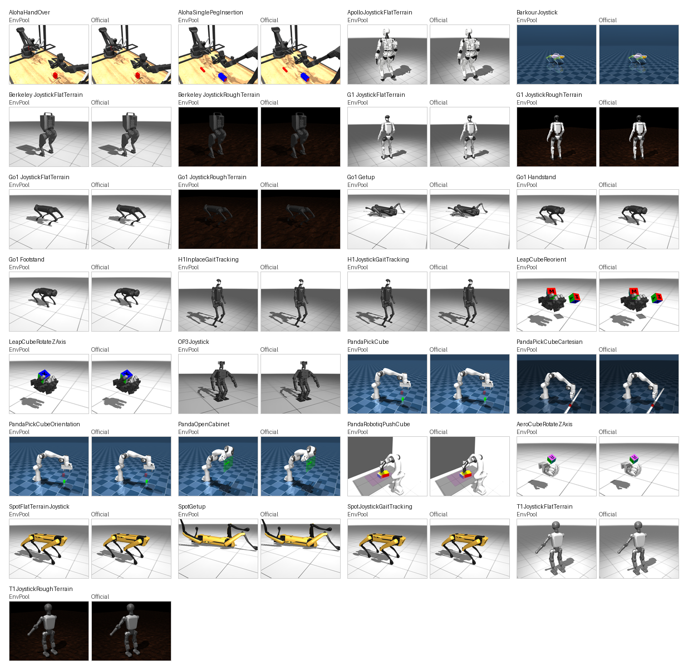

MuJoCo Playground
=================

EnvPool provides native C++ implementations for the non-DM-Control tasks from
``google-deepmind/mujoco_playground`` tag ``v0.2.0``. This covers all 19
Playground locomotion tasks and all 10 Playground manipulation tasks in that
release. The implementation uses the pinned Playground XMLs together with
``google-deepmind/mujoco_menagerie`` commit
``1b86ece576591213e2b666ebf59508454200ca97`` for robot assets.

MuJoCo Playground also vendors DM Control Suite tasks, but EnvPool already
ships those through the existing :doc:`dm_control` family. They are not
registered again here.

Each task has both the direct task ID and a ``MuJoCoPlayground/`` alias, for
example ``Go1Getup-v1`` and ``MuJoCoPlayground/Go1Getup-v1``.

Task Coverage
-------------

All action spaces are ``Box(-1, 1, dtype=float64)``. All tasks support
``render_mode="rgb_array"`` and pixel-only observations through
``from_pixels=True``.

.. list-table::
   :header-rows: 1
   :widths: 30 18 23 10 9

   * - EnvPool task ID
     - Upstream task
     - Observation
     - Action
     - Render
   * - ``AlohaHandOver-v1``
     - ``AlohaHandOver``
     - ``obs`` shape ``(83,)``
     - ``(14,)``
     - yes
   * - ``AlohaSinglePegInsertion-v1``
     - ``AlohaSinglePegInsertion``
     - ``obs`` shape ``(82,)``
     - ``(14,)``
     - yes
   * - ``ApolloJoystickFlatTerrain-v1``
     - ``ApolloJoystickFlatTerrain``
     - ``state`` ``(112,)``; ``privileged_state`` ``(224,)``
     - ``(32,)``
     - yes
   * - ``BarkourJoystick-v1``
     - ``BarkourJoystick``
     - ``obs`` shape ``(465,)``
     - ``(12,)``
     - yes
   * - ``BerkeleyHumanoidJoystickFlatTerrain-v1``
     - ``BerkeleyHumanoidJoystickFlatTerrain``
     - ``state`` ``(52,)``; ``privileged_state`` ``(114,)``
     - ``(12,)``
     - yes
   * - ``BerkeleyHumanoidJoystickRoughTerrain-v1``
     - ``BerkeleyHumanoidJoystickRoughTerrain``
     - ``state`` ``(52,)``; ``privileged_state`` ``(114,)``
     - ``(12,)``
     - yes
   * - ``G1JoystickFlatTerrain-v1``
     - ``G1JoystickFlatTerrain``
     - ``state`` ``(103,)``; ``privileged_state`` ``(216,)``
     - ``(29,)``
     - yes
   * - ``G1JoystickRoughTerrain-v1``
     - ``G1JoystickRoughTerrain``
     - ``state`` ``(103,)``; ``privileged_state`` ``(216,)``
     - ``(29,)``
     - yes
   * - ``Go1JoystickFlatTerrain-v1``
     - ``Go1JoystickFlatTerrain``
     - ``state`` ``(48,)``; ``privileged_state`` ``(123,)``
     - ``(12,)``
     - yes
   * - ``Go1JoystickRoughTerrain-v1``
     - ``Go1JoystickRoughTerrain``
     - ``state`` ``(48,)``; ``privileged_state`` ``(123,)``
     - ``(12,)``
     - yes
   * - ``Go1Getup-v1``
     - ``Go1Getup``
     - ``state`` ``(42,)``; ``privileged_state`` ``(91,)``
     - ``(12,)``
     - yes
   * - ``Go1Handstand-v1``
     - ``Go1Handstand``
     - ``state`` ``(45,)``; ``privileged_state`` ``(94,)``
     - ``(12,)``
     - yes
   * - ``Go1Footstand-v1``
     - ``Go1Footstand``
     - ``state`` ``(45,)``; ``privileged_state`` ``(94,)``
     - ``(12,)``
     - yes
   * - ``H1InplaceGaitTracking-v1``
     - ``H1InplaceGaitTracking``
     - ``obs`` shape ``(186,)``
     - ``(19,)``
     - yes
   * - ``H1JoystickGaitTracking-v1``
     - ``H1JoystickGaitTracking``
     - ``obs`` shape ``(113,)``
     - ``(19,)``
     - yes
   * - ``LeapCubeReorient-v1``
     - ``LeapCubeReorient``
     - ``state`` ``(57,)``; ``privileged_state`` ``(128,)``
     - ``(16,)``
     - yes
   * - ``LeapCubeRotateZAxis-v1``
     - ``LeapCubeRotateZAxis``
     - ``state`` ``(32,)``; ``privileged_state`` ``(105,)``
     - ``(16,)``
     - yes
   * - ``Op3Joystick-v1``
     - ``Op3Joystick``
     - ``obs`` shape ``(147,)``
     - ``(20,)``
     - yes
   * - ``PandaPickCube-v1``
     - ``PandaPickCube``
     - ``obs`` shape ``(66,)``
     - ``(8,)``
     - yes
   * - ``PandaPickCubeCartesian-v1``
     - ``PandaPickCubeCartesian``
     - ``obs`` shape ``(70,)``
     - ``(3,)``
     - yes
   * - ``PandaPickCubeOrientation-v1``
     - ``PandaPickCubeOrientation``
     - ``obs`` shape ``(66,)``
     - ``(8,)``
     - yes
   * - ``PandaOpenCabinet-v1``
     - ``PandaOpenCabinet``
     - ``obs`` shape ``(55,)``
     - ``(8,)``
     - yes
   * - ``PandaRobotiqPushCube-v1``
     - ``PandaRobotiqPushCube``
     - ``obs`` shape ``(48,)``
     - ``(7,)``
     - yes
   * - ``AeroCubeRotateZAxis-v1``
     - ``AeroCubeRotateZAxis``
     - ``state`` ``(14,)``; ``privileged_state`` ``(81,)``
     - ``(7,)``
     - yes
   * - ``SpotFlatTerrainJoystick-v1``
     - ``SpotFlatTerrainJoystick``
     - ``state`` ``(81,)``; ``privileged_state`` ``(167,)``
     - ``(12,)``
     - yes
   * - ``SpotGetup-v1``
     - ``SpotGetup``
     - ``obs`` shape ``(30,)``
     - ``(12,)``
     - yes
   * - ``SpotJoystickGaitTracking-v1``
     - ``SpotJoystickGaitTracking``
     - ``obs`` shape ``(69,)``
     - ``(12,)``
     - yes
   * - ``T1JoystickFlatTerrain-v1``
     - ``T1JoystickFlatTerrain``
     - ``state`` ``(85,)``; ``privileged_state`` ``(180,)``
     - ``(23,)``
     - yes
   * - ``T1JoystickRoughTerrain-v1``
     - ``T1JoystickRoughTerrain``
     - ``state`` ``(85,)``; ``privileged_state`` ``(180,)``
     - ``(23,)``
     - yes

Render
------

Rendering is implemented in C++ through EnvPool's MuJoCo
``OffscreenRenderer``. The Playground env owns the same ``mjModel`` and
``mjData`` used by stepping; ``env.render()`` draws directly from that native
state. Pixel-observation variants render once per reset or step, update the
frame stack, and cache that same frame so a same-step ``env.render()`` call
returns the identical image.

The render API supports ``render_mode="rgb_array"``, ``render_width``,
``render_height``, and ``render_camera_id``. If no explicit render size is
requested, ``env.render()`` uses 480 by 480 pixels. Pixel observations default
to 84 by 84 pixels.

Like other native MuJoCo environments in EnvPool, MuJoCo Playground also
supports pixel-only observations through ``from_pixels=True``. In that mode the
public observation is ``obs["pixels"]`` with channel-first shape
``(3 * frame_stack, render_height, render_width)`` and dtype ``uint8``; the
state and privileged-state vectors are not returned as observations.

.. code-block:: python

   import envpool

   env = envpool.make_gymnasium(
       "Go1JoystickFlatTerrain-v1",
       num_envs=8,
       from_pixels=True,
       frame_stack=3,
       render_width=84,
       render_height=84,
       render_mode="rgb_array",
   )
   obs, info = env.reset()

The reset-frame comparison below places EnvPool on the left and the official
MuJoCo Playground renderer on the right. The documentation image is generated
by syncing the official renderer from EnvPool's reset ``qpos`` and ``qvel``
debug fields, so both sides render the same MuJoCo state. The comparison
ignores RGB channel deltas up to 3/255 when counting mismatched pixels, while
still enforcing a bounded raw mean absolute difference.

For ``Op3Joystick-v1`` the official render-side model is loaded from the
filesystem XML/assets instead of MuJoCo Playground's in-memory asset dict.
OP3's visual meshes and simplified collision meshes share STL basenames, and
MuJoCo's asset dict cannot represent both at once without collapsing the visual
model to the simplified collision mesh. The filesystem path keeps the same
pinned XML and menagerie assets while preserving the intended visual meshes.

Regenerate the image with:

.. code-block:: bash

   bazel run --config=debug //scripts:render_compare -- \
     --family=mujoco_playground \
     --columns=4 \
     --source-width=480 \
     --source-height=360 \
     --tile-width=144 \
     --tile-height=108 \
     --max-mean-abs-diff=4.2 \
     --max-mismatch-ratio=0.15 \
     --max-ignored-abs-diff=3

Validation
----------

The native implementation is checked against the official MuJoCo Playground
Python oracle. The coverage test compares EnvPool's Playground registry against
the pinned upstream ``locomotion.ALL_ENVS`` and ``manipulation.ALL_ENVS`` lists;
the vendored DM Control Suite registry is intentionally excluded.

The alignment test reset-syncs MuJoCo state once, then drives both
implementations with the same external actions and compares observations,
rewards, termination flags, truncation flags, and exposed info fields.

Rendering is checked separately on reset and for the first three control steps
against the official MuJoCo renderer using the same synchronized state. The
test keeps per-task pixel budgets narrow because OpenGL rasterization can leave
small backend-dependent edge differences even when the MuJoCo state is aligned.
