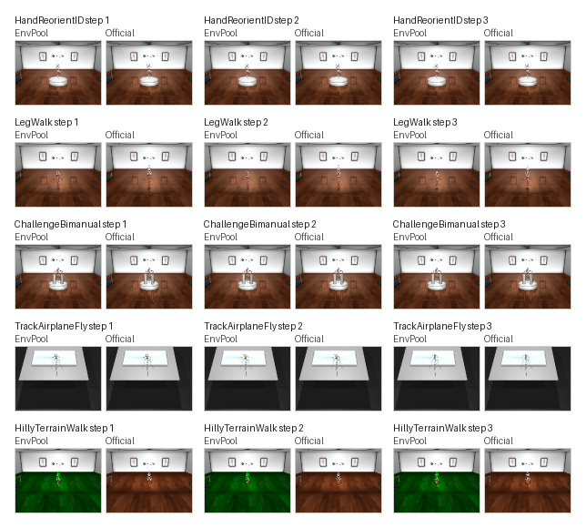

MyoSuite
========

EnvPool provides native C++ implementations for the MyoSuite benchmark pinned
to ``MyoHub/myosuite`` commit ``05cb84678373f91271004f99602ebbf01e57d1a1``
(``v2.11.6``). The public EnvPool IDs follow the official upstream registry
directly instead of introducing a parallel naming scheme.

Supported Surface
-----------------

The native port covers the full generated MyoSuite metadata surface:

* 45 direct MyoBase task IDs
* 19 direct MyoChallenge task IDs
* 190 direct MyoDM TrackEnv task IDs
* 398 public task IDs after expanding the official fatigue, sarcopenia, and
  reafferentation variants

Representative public IDs include:

.. code-block:: text

    myoHandReorientID-v0
    myoFatiHandReorientID-v0
    myoLegRoughTerrainWalk-v0
    myoChallengeBimanual-v0
    myoSarcChallengeBimanual-v0
    MyoHandAirplaneFly-v0

The public registration keeps the official MyoSuite task IDs unchanged, so
existing downstream experiment configs can move to EnvPool without renaming the
tasks.

Observation and Action Spaces
-----------------------------

MyoSuite is a heterogeneous benchmark, so observation and action shapes vary by
task family:

* MyoBase exposes hand, arm, torso, and locomotion tasks such as pose, reach,
  reorient, key turn, object hold, pen twirl, walk, and terrain locomotion.
* MyoChallenge exposes the official challenge tasks including reorient,
  relocate, baoding, bimanual passing, run-track locomotion, soccer, chase-tag,
  and table tennis.
* MyoDM exposes object-conditioned ``TrackEnv`` tasks such as
  ``MyoHandAirplaneFly-v0`` through the same native registration path.

All tasks support the standard EnvPool batched Gymnasium and dm_env wrappers,
and MuJoCo pixel wrappers are available through ``from_pixels=True``.

Render
------

MyoSuite render support ships through the same native MuJoCo pixel path used by
other EnvPool MuJoCo families. Representative render compares for MyoBase
reorient, walk, terrain, MyoChallenge, and MyoDM TrackEnv tasks are shown
below. Each panel shows EnvPool on the left and the official MyoSuite renderer
on the right for the first three stepped rollout frames after a reset-time
state sync. The terrain row intentionally shows the official MyoSuite
offscreen renderer limitation: upstream mutates terrain heightfields at reset
time but does not upload those updates into its generic offscreen
``mujoco.Renderer`` context, so the official terrain panels stay on the flat
floor while EnvPool renders the sampled terrain directly from native MuJoCo
state.

Validation
----------

The MyoSuite integration is validated in four layers:

* generated metadata checks for the full upstream registry surface
* deterministic rollout tests for the native implementations
* 32-step oracle alignment against the official MyoSuite Python
  implementation for representative MyoBase, MyoChallenge, and MyoDM tasks
* public ``render()`` validation that checks reset and the first three stepped
  frames against the official MyoSuite renderer for representative reorient,
  walk, challenge, and TrackEnv tasks with tight raster thresholds, plus a
  terrain-specific multi-step render test and documented official visual
  reference frames
* public registration tests that construct direct and variant IDs through
  ``make_gymnasium`` and verify that fatigue, sarcopenia, and reafferentation
  variants actually change rollout dynamics
