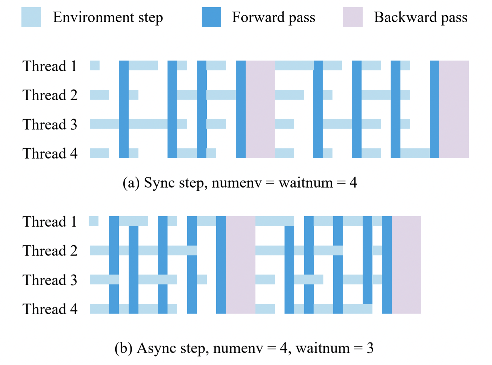

Interface
=========

envpool.make
------------

The main interface is ``envpool.make`` where we can provide a task id and some
other arguments (as specified below) to generate different configuration of
batched environments:

* ``task_id (str)``: task id, use ``envpool.list_all_envs()`` to see all
  support tasks;
* ``env_type (str)``: generate with ``gym.Env`` or ``dm_env.Environment``
  interface, available options are ``dm`` and ``gym``;
* ``num_envs (int)``: how many envs are in the envpool, default to ``1``;
* ``batch_size (int)``: async configuration, see the last section, default
  to ``num_envs``;
* ``num_threads (int)``: the maximum thread number for executing the actual
  ``env.step``, default to ``batch_size``;
* ``seed (int)``: set seed over all environments. The i-th environment seed
  will be set with i+seed, default to ``42``;
* ``max_episode_steps (int)``: set the max steps in one episode. This value is
  env-specific (108000 in Atari for example);
* ``max_num_players (int)``: the maximum number of player in one env, useful
  in multi-agent env. In single agent environment, it is always ``1``;
* ``thread_affinity_offset (int)``: the start id of binding thread. ``-1``
  means not to use thread affinity in thread pool, and this is the default
  behavior;
* other configurations such as ``img_height`` / ``img_width`` / ``stack_num``
  / ``frame_skip`` / ``noop_max`` in Atari env, ``reward_metric`` /
  ``lmp_save_dir`` in ViZDoom env, please refer to the corresponding pages.

The observation space and action space of resulted environment are
**channel-first** single environment's space, but each time the
observation/action's first dimension is always equal to ``num_envs``
(sync mode) or equal to ``batch_size`` (async mode).

``envpool.make_gym`` and ``envpool.make_dm`` are shortcuts for
``envpool.make(..., env_type="gym" | "dm")``, respectively.

envpool.make_spec
-----------------

If you don't want to create a fake environment, meanwhile want to get the
observation / action space, ``envpool.make_spec`` would help. The argument is
the same as ``envpool.make``, and you can use

- ``spec.observation_space`` gym's observation space;
- ``spec.action_space`` gym's action space;
- ``spec.observation_spec()`` dm_env's observation spec;
- ``spec.action_spec()`` dm_env's action spec;

to get the desired spec.

Extended API
------------

We mainly change two functions' semantic: ``reset`` and ``step``, meanwhile
add another two primitives ``send`` and ``recv``:

* ``reset(id: Union[np.ndarray, None]) -> TimeStep``: reset the given ``id``
  envs and return the corresponding observation;
* ``async_reset() -> None``: it only sends the reset command to the executor
  and return nothing;
* ``send(action: Any, env_id: Optional[np.ndarray] = None) -> None``: send the
  action with corresponding env ids to executor (thread pool). ``action`` can
  be numpy array (single observation) or a dict (multiple observations);
* ``recv() -> Union[TimeStep, Tuple[Any, np.ndarray, np.ndarray, np.ndarray]]``
  : receive the finished env ids (in ``timestep.observation.obs.env_id`` (dm)
  or ``info["env_id"]`` (gym)) and corresponding result from executor;
* ``step(action: Any, env_id: Optional[np.ndarray] = None) -> Union[TimeStep,
  Tuple[Any, np.ndarray, np.ndarray, Any]]``: given an action, an env (maybe
  with player) id list where ``len(action) == len(env_id)``, the envpool will
  put these requests into a thread pool; then, if it reaches certain
  conditions (explain later), it will return the env id list ``env_id`` and
  result that finished stepping.

In short, ``step(action, env_id)`` == ``send(action, env_id); return recv()``

Action Input Format
-------------------

EnvPool supports two action formats in ``send`` and ``step``:

- ``(action: np.ndarray, env_id: Optional[np.ndarray] = None)``: for
  single-array action input;
- ``action: Dict[str, Any]``: for multi key-value action input, or in
  multi-player env some player's action space are not the same.

For example, in Atari games, we can use the following action formats:
::

    envpool.send(np.ones(batch_size))
    envpool.send(np.ones(batch_size), env_id=np.arange(batch_size))
    envpool.send({
      # note: please be careful with dtype here
      "action": np.ones(batch_size, dtype=np.int32),
      "env_id": np.arange(batch_size, dtype=np.int32),
     })

For the first and second cases, use ``env.step(action, env_id)``; for the
third case, use ``env.step(action)`` where action is a dictionary.

.. _output_format:

Data Output Format
------------------

+----------+---------------------------------------------+------------------------------------------------------------------+
| function |   gym                                       | dm                                                               |
|          |                                             |                                                                  |
+==========+=============================================+==================================================================+
|   reset  |  | env_id -> obs array (single observation) | env_id -> TimeStep(FIRST, obs|info|env_id, rew=0, discount or 1) |
|          |  | or an obs dict (multi observation)       |                                                                  |
+----------+---------------------------------------------+------------------------------------------------------------------+
|   step   |  (obs, rew, done, info|env_id)              | TimeStep(StepType, obs|info|env_id, rew, discount or 1 - done)   |
+----------+---------------------------------------------+------------------------------------------------------------------+

Note: ``gym.reset()`` doesn't support async step setting because it cannot get ``env_id`` from ``reset()`` function, so it's better to use low-level APIs such as ``send`` and ``recv``.

Batch Size
----------

In asynchronous setting, ``batch_size`` means when the finished stepping
thread number >= ``batch_size``, we return the result. The figure below
demonstrate this idea (``waitnum`` is the same as ``batch_size``):

The synchronous step is a special case by using the above API:
``batch_size == num_envs``, ``id`` is always all envs' id.

Auto Reset
----------

EnvPool enables auto-reset by default. Let's suppose an environment that has a
``max_episode_steps = 3``. When we call ``env.step(action)`` five consecutive
times, the following would happen:

1. the first call would trigger ``env.reset()`` and return with
   ``done = False`` and ``reward = 0``, i.e., the action will be discarded;
2. the second call would trigger ``env.step(action)`` and elapsed step is 1;
3. the third call would trigger ``env.step(action)`` and elapsed step is 2;
4. the fourth call would trigger ``env.step(action)`` and elapsed step is 3.
   At this time it returns ``done = True`` and (if using gym)
   ``info["TimeLimit.truncated"] = True``;
5. the fifth call would trigger ``env.reset()`` since the last episode has
   finished, and return with ``done = False`` and ``reward = 0``, i.e., the
   action will be discarded.

+---+-------------+-------------+---------+-----------------------+
| # | User Call   | Actual      | Elapsed | Misc                  |
+===+=============+=============+=========+=======================+
| 1 | env.step(a) | env.reset() | 0       |                       |
+---+-------------+-------------+---------+-----------------------+
| 2 | env.step(a) | env.step(a) | 1       |                       |
+---+-------------+-------------+---------+-----------------------+
| 3 | env.step(a) | env.step(a) | 2       |                       |
+---+-------------+-------------+---------+-----------------------+
| 4 | env.step(a) | env.step(a) | 3       | Hit max_episode_steps |
+---+-------------+-------------+---------+-----------------------+
| 5 | env.step(a) | env.reset() | 0       |                       |
+---+-------------+-------------+---------+-----------------------+
